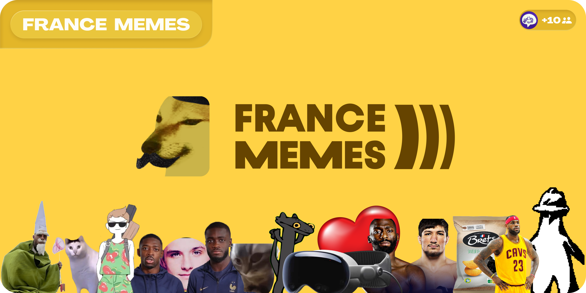
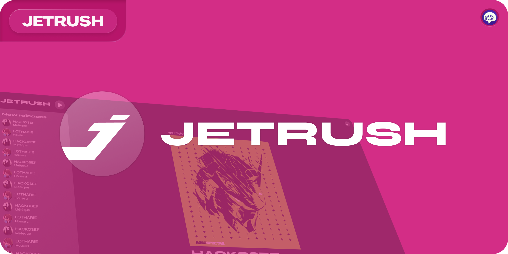
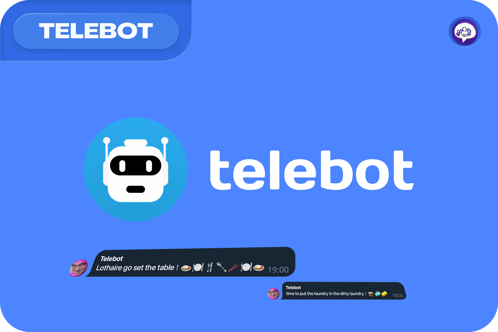
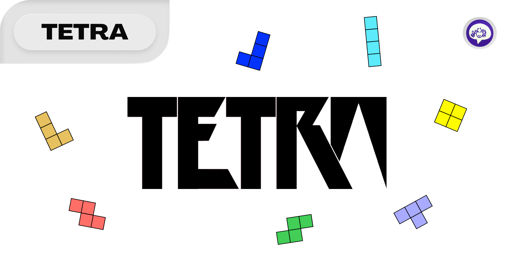

[][website]

  

<!-- Websites -->
[website]: https://lotharie.net/

### My projects

<table width="100%" style="border-collapse: collapse; border: none; vertical-align: top;">
	<tr>
		<td width="49%" style="border: none; padding: 5px;vertical-align: top;">
			
			
			
			
		</td>
		<td width="49%" style="border: none; padding: 5px; vertical-align: top;">
			
			
			
			
		</td>
	</tr>
</table>

### School projects

<table width="100%" style="border-collapse: collapse; border: none; vertical-align: top;">
	<tr>
		<td width="49%" style="border: none; padding: 5px;vertical-align: top;">
			
			
		</td>
		<td width="49%" style="border: none; padding: 5px; vertical-align: top;">
			
			
			
		</td>
	</tr>
</table>

### Public companies projects

<table width="100%" style="border-collapse: collapse; border: none; vertical-align: top;">
	<tr>
		<td width="49%" style="border: none; padding: 5px;vertical-align: top;">
			
		</td>
		<td width="49%" style="border: none; padding: 5px; vertical-align: top;">
		</td>
	</tr>
</table>

 

### My stack

<table align="center">
 <thead>
  <tr>
   <th colspan="2"><b>Software Development</b></th>
   <th colspan="1"><b>Computer Graphics</b></th>
   <th colspan="1"><b>Front-end</b></th>
   <th colspan="1"><b>Database</b></th>
   <th colspan="2"><b>Creative</b></th>
   <th colspan="3"><b>Environments & Tools</b></th>
   <th colspan="1"><b>👀</b></th>
  </tr>
 </thead>
 <tbody>
  <tr>
   <td align="center"></td>
   <td align="center"></td>
   <td align="center"></td>
   <td align="center"></td>
   <td align="center"></td>
   <td align="center"></td>
   <td align="center"></td>
   <td align="center"></td>
   <td align="center"></td>
   <td align="center"></td>
   <td align="center"></td>
  </tr>
  <tr>
   <td align="center"></td>
   <td align="center"></td>
   <td align="center"></td>
   <td align="center"></td>
   <td align="center"></td>
   <td align="center"></td>
   <td align="center"></td>
   <td align="center"></td>
   <td align="center"></td>
   <td align="center"></td>
   <td align="center"></td>
  </tr>
  <tr>
   <td align="center"></td>
   <td align="center"></td>
   <td align="center"></td>
   <td align="center"></td>
   <td align="center"></td>
   <td align="center"></td>
   <td align="center"></td>
   <td align="center"></td>
   <td align="center"></td>
   <td align="center"></td>
   <td align="center"></td>
  </tr>
  <tr>
   <td align="center"></td>
   <td align="center"></td>
   <td align="center"></td>
   <td align="center"></td>
   <td align="center"></td>
   <td align="center"></td>
   <td align="center"></td>
   <td align="center"></td>
   <td align="center"></td>
   <td align="center"></td>
   <td align="center"></td>
  </tr>
  <tr>
   <td align="center"></td>
   <td align="center"></td>
   <td align="center"></td>
   <td align="center"></td>
   <td align="center"></td>
   <td align="center"></td>
   <td align="center"></td>
   <td align="center"></td>
   <td align="center"></td>
   <td align="center"></td>
   <td align="center"></td>
  </tr>
 </tbody>
</table>

 

### My stats

 
 

